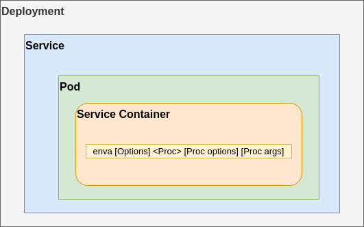

# environtment store

1. Service start command line args, options and configs in the yaml files(use `application/service spec` in the next context) will not need to change at most time.
1. Move changeable command line args, options and configs from `application/service spec` to env store.
1. Auto restart service when any of args, options or configs changed.

## Key register & setup flow
1. (DevOps) Start envs + state
1. (Auto) envs scan application/service specs
1. (Auto) Required keys scanned
1. (Auto) Swagger.json ready
1. (DevOps) Get swagger.json
1. (DevOps) PUT /keys {key1: val1, ..., keyN: valN}
1. (DevOps) Start service
1. (Dev) Upload new application/service spec to envs, if there is a new application/service developed

## Conventions
1. Required key `${env:// .key }`
1. Required file key `${envf:// .keyf }`
1. Allowed key name pattern `\${env(f)?:// *\.([_a-zA-Z][_a-zA-Z0-9]*) *(\| *default ([\-./:*,@_a-zA-Z0-9]*))? *}`

## TODO
- [x] enva start application/service
- [x] Support envf
- [x] Scan application/service spec
- [x] Render application/service spec from env store
- [x] Implement query on store level for keys
- [x] Implement GET, PUT REST APIs for keys
- [x] Implement Register REST APIS for new application/service spec
- [x] Serve swagger.json
- [x] Refactor enva to use envs instead of using naked underlying etcd/consul
- [x] Intercept os ENV vars and render os env files
- [x] Wrap sso, ac, profile, configurator images to include `enva`~~, `s4`(simple static site service) binary~~
- [x] ~~Serve front end with s4~~, [continue to use nginx to serve front end](#Keep-using-nginx-as-the-frontend-site-server)
- [x] Export & Import Key values APIs 
- [x] Local app specs for dev purpose
- [x] Support env/envf with default value, if given default value and the key doesn't existed before, publish to underlying store
- [x] enva publish kvs to envs
- [x] Support key watch & restart
- [x] Decouple oidc client & callback registration flow 
- [x] Minimize the required env vars
- [x] Tutorial documentation
- [x] Push new service/application docker images to registry
- [x] Expose OAuth2.0 Client registration via envs API
- [ ] Frontend use envs to render index.html directly instead of putting env key into OSEnv and render OSEnv then render index.html via OSEnv
- [ ] ~~Create a `init` CLI for db's kv publish & merge `oidcr` into it.~~
- [ ] Health check endpoint for enva
- [ ] Replace nginx with our own `simple static site service(s4)`
- [ ] An extensive way to extend the pre-configuration for service startup, e.g, create database if not exist etc.
- [ ] ~~Migrate specs at startup~~
- [ ] Kubernetes operator...
- [ ] API for starting service
- [ ] env store on k8s, istio

## Tutorials

There is an `all-in-one` [docker-compose.yaml](assets/devspecs/docker-compose.yaml) for our service/application start specs, we can choose/select the services we wish to use and start them separately via `docker-compose up -d s1 s2`.
Based on different service/application we are trying to use, there are different key values pairs we need to set into `env store` to have the service/application start/works as expected.

1. Add `docekr.host.internal` into `/etc/hosts` and point to `127.0.0.1`
1. Start underlying env store storage service `docker-compose up -d consul`, go to `http://localhost:8500/ui` & check if consul works
1. Start env store service `docker-compose up -d envs`, go `http://localhost:9112` & check if envs works.
1. Create docker network `docker network create meera`
1. Start the interested services by following the [minimized steps](#Minimized-steps)

## Minimized steps

1. Check the service/application logs we started & set the missing values into env store one by one via `envs` API call 
1. Or import the [minimized values](assets/devspecs/minimized-kvs.yaml) into env store via `envs` API call directly

### Vendor services
1. postgres
1. rabbitstomp
1. redis
1. mongodb
1. minio

### SSO  
1. Set ssoIssuer value
1. Set postgresHost value
1. Set ssoDBUser value
1. Set ssoDBPassword value
1. echo "create database sso;" | psql -h localhost -p 5432 -U postgres 

### Register OAuth2 clients

1. Whenever we want to start a web site that has OAuth2 integrated, 
we need to make sure OAuth2 client has been registered & published into env store with our name conventions.
1. Go `http://localhost:9112` `add-ons` section, Use envs API `oidcr` to register the new OAuth2 clients
1. Check example file from `http://localhost:9112/example/oidcr`
1. Follow the example, add our new OAuth2 params into `clients` array 
1. Send registration request to envs

### SSO client
1. Register ssoOAuth2 client

### AC
1. Set acDSN value

### AC console
1. Register acOAuth2 client
1. Set acHTTPAddr value

### Profile gRPC
1. Set profileDSN value
1. Set rabbitMQAddr value

### Profile GraphQL
1. Set profileCORS value
1. Set redisAddr value
1. Set sesGRPCAddr value
1. Set msgPusherGRPCAddr value
1. Set notificationAddr value

### Configurator-be
1. Set configuratorDSN value

### Configurator-fe
1. Register configuratorOAuth2 client
1. Set configuratorHTTPAddr value
1. Set profileHTTPAddr value

## FAQs

### Keep using nginx as the frontend site server

1. It will require only very little changes to adopt to `envs` management flow
1. It's a full featured & lightweight web server
1. Will replace nginx with our own site service `s4` eventually

### enva position in k8s use case

- enva is located in the k8s pod and inside the service/application's container
- It works as a supervisor process of the service/application process.
- The k8s position of enva was described as follows

### Use cases
1. (Security)Add another isolated layer to configure the credentials instead config it in compose/k8s/helm yaml files directly.
1. (DevOps)Change config value & restart automatically.
1. (Dev/DevOps)Centralise/Unify vendor images version.
1. (BackendDev)Spilt fundamental/basic services and application service into two start-up phase.
1. (BackendDev)Share same fundamental/basic services during develop multiple service at same time.
1. (BackendDev)Setup the basic frontend website, such as sso-example-app, acconsole, configurator.
1. (FrontendDev)Minimised steps to setup local fundamental services for development.
