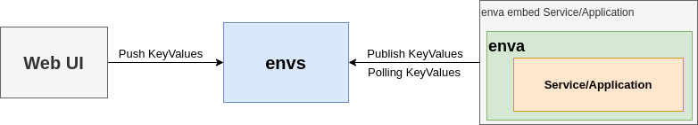

# environtment store

1. Service start command line args, options and configs in the yaml files(use `application/service spec` in the next
   context) will not need to change at most time.
1. Move changeable command line args, options and configs from `application/service spec` to env store.
1. Auto restart service when any of args, options or configs changed.

In this README:

- [Use cases](#use-cases)
- [Conventions](#conventions)
- [Tutorials](#tutorials)
- [Architecture](#architecture)
- [Liveness/Readiness Probe](#livenessreadiness-probe)
- [Minimized steps for different services](#minimized-steps)
- [FAQs](#faqs)
- [TODOs](#todo)

## Use cases

1. (Security)Add another isolated layer to configure the credentials instead config it in compose/k8s/helm yaml files
   directly.
1. (DevOps)Change config value & restart automatically.
1. (Dev/DevOps)Centralise/Unify vendor images version.

## Conventions

1. Required key `${env:// .key }`
1. Optional key `${envo:// .key }`
1. Required file key `${envf:// .keyf }`
1. Allowed key name
   pattern `\${env([of])?:// *\.([_a-zA-Z][_a-zA-Z0-9]*) *(\| *default ([~!@#$%^&*()\-_+={}\[\]:";'<>,.?/|\\a-zA-Z0-9]*))? *}`
1. Set key with `empty` default value, eg, `${env:// .key1 | default '' }`

## Tutorials

Check [docker-compose.yaml](assets/devspecs/docker-compose.yaml) as an example, we can choose/select the services we
wish to use and start them separately via `docker-compose up -d s1 s2`. Based on different service/application we are
trying to use, there are different key values pairs we need to set into `env store` to have the service/application
start/works as expected.

1. Add `docker.host.internal` into `/etc/hosts` and point to `127.0.0.1`
1. Start env store service `docker-compose up -d envs`, go `http://localhost:9112` & check if envs works.
1. Create docker network `docker network create meera`
1. Start the interested services by following the [minimized steps](#Minimized-steps) before
   using `docker-compose up -d svc`

## Architecture

There are three components in environment store lifecycle

1. envs, core service of environment store, accept kv get/set.
1. website, interactive with envs via REST APIs
1. enva, agent of envs which act as the bridge between envs & service/application, publish & render/watch
   service/application key value pairs



### Liveness/Readiness probe

1. In order to report if a pod is ready to serve request or not, envs/enva expose an HTTP-based status report endpoint
   to the upstream control panel.
1. To perform a probe, the kubelet sends an HTTP GET request to the Proc that is running in the container and listening
   on the given port.
1. If the handler for the Proc's status endpoint returns a success code, the kubelet considers the container to be alive
   and healthy.
1. If the handler returns a failure code, the kubelet kills the container and restarts it when `liveness probe` enabled.
1. If the handler returns a failure code, the kubelet mark the container is not available for serving request
   when `readiness probe` enabled.
1. Any code greater than or equal to 200 and less than 400 indicates success. Any other code indicates failure.

#### envagent

1. enva will serve a http endpoint for status reporting if you provide with command-line flag `status-endpoint` or by
   setting ENVA_STATUS_ENDPOINT os env
1. the response of the status-endpoint would be one of `200`, `201`, `410`, in which `200` means pod ready, `201` means
   enva is running but the `Proc` is starting, `410` means `Proc` is stopped.
1. please make sure the given port in the endpoint MUST NOT conflict with the `Proc` required ports.
1. let's say enva is started with `http://127.0.0.1:8503/healthz` as status-endpoint, the k8s liveness or readiness
   probe would like as follows:

```yaml
# liveness
livenessProbe:
  httpGet:
    path: /healthz
    port: 8503
  failureThreshold: 10
  periodSeconds: 30

# readiness 
readinessProbe:
  httpGet:
    path: /healthz
    port: 8503
  initialDelaySeconds: 30
  periodSeconds: 30
```

#### envs

1. envs provide an endpoint `/healthz` for status reporting, which can be used as the k8s liveness or readiness probe
   endpoint
1. let's say the envs is serving at port 9111, the kubernetes readiness probe would like as follows:

```yaml
# liveness
livenessProbe:
  httpGet:
    path: /healthz
    port: 9111
  failureThreshold: 10
  periodSeconds: 30

# readiness 
readinessProbe:
  httpGet:
    path: /healthz
    port: 9111
  initialDelaySeconds: 30
  periodSeconds: 30
```

## FAQs

### Keep using nginx as the frontend site server

1. It will require only very little changes to adopt to `envs` management flow
1. It's a full featured & lightweight web server
1. Will replace nginx with our own site service `s4` eventually

### enva position in k8s use case

- enva is located in the k8s pod and inside the service/application's container
- It works as a supervisor process of the service/application process.
- The k8s position of enva was described as follows


### How to echo a env var in one line

```bash
enva --log-level none --run-only-once echo '${env:// .abc}'
```

## TODO

- [x] enva start application/service
- [x] Support envf
- [x] Scan application/service spec
- [x] Render application/service spec from env store
- [x] Implement query on store level for keys
- [x] Implement GET, PUT REST APIs for keys
- [x] Implement Register REST APIS for new application/service spec
- [x] Serve swagger.json
- [x] Refactor enva to use envs instead of using naked underlying etcd/consul
- [x] Intercept os ENV vars and render os env files
- [x] Wrap sso, ac, profile, configurator images to include `enva`~~, `s4`(simple static site service) binary~~
- [x] ~~Serve front end with
  s4~~, [continue to use nginx to serve front end](#Keep-using-nginx-as-the-frontend-site-server)
- [x] Export & Import Key values APIs
- [x] Local app specs for dev purpose
- [x] Support env/envf with default value, if given default value and the key doesn't existed before, publish to
  underlying store
- [x] enva publish kvs to envs
- [x] Support key watch & restart
- [x] Decouple oidc client & callback registration flow
- [x] Minimize the required env vars
- [x] Tutorial documentation
- [x] Push new service/application docker images to registry
- [x] Expose OAuth2.0 Client registration via envs API
- [x] Keep enva running if envs stopped
- [x] Health check endpoint for enva
- [ ] Add a cli tool to upload env & envf & add-ons files via API call
- [ ] Support auth & authz with ReadOnly & Admin user permission
- [ ] Audit on every API call for tracing who/when/what
- [x] Apart from `default` keyword, add `overwrite`, `readonly` keywords support
- [ ] Refactor oicr registration add-ons API to support multiple redirect URIs
- [ ] Add-ons API support for extending the pre-configuration of service startup, e.g, create dbUser/db if not exist
  etc.
- [x] Frontend use envs to render index.html directly instead of putting env key into OSEnv and render OSEnv then render
  index.html via OSEnv
- [ ] Support regex search against on key name in GetKeys API
- [x] ~~Create a `init` CLI for db's kv publish & merge `oidcr` into it.~~
- [ ] Replace nginx with our own `simple static site service(s4)`
- [x] ~~Migrate specs at startup~~
- [ ] Kubernetes operator...
- [ ] API for starting service
- [ ] env store on k8s, istio
